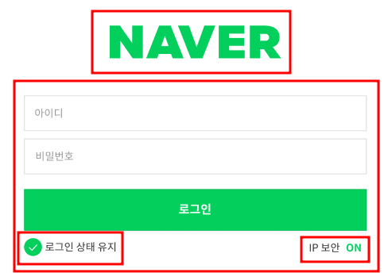

# 3주차 과제 NAVER 로그인 화면 만들어 보기

## 목차

1. 작업 순서
2. 사용한 코드 (HTML)
3. 사용한 코드 (CSS)
4. 과제 수행 중 미흡한 점 및 보강할 점

## 1. 작업순서

- 이미지는 크게 2개의 테이블로 구분하였다. 
- 상단의 NAVER 로고 / 몸통의 로그인 입력창 부분 
- 몸통 부분은 다시 5개의 부분으로 구분하였다.  
  -> 아이디 입력 창 / 패스워드 입력 창 / 로그인 버튼  
  -> 로그인 상태 유지 / IP 보안 
- 이중 아이디 입력 창, 패스워드 입력 창, 로그인 버튼의 경우 각각의 섹션으로 생각을 하였다.  
- 로그인 상태 유지의 경우 체크박스와 문구 2개의 섹션으로 구분하였다. 
- IP 보안의 경우 문구, 하이퍼링크, ON/OFF 3개의 섹션으로 구분하였다. 

## 2.사용한 코드 (HTML)

- 상단의 NAVER는 로고를 삽입하는 대신 타이핑으로 입력하였다.  
  -> 대제목을 나타내는 H1 태그를 사용  
  -> 상단부분의 Action 태그를 사용하여 데이터를 도착할 수신처를 작성 
  -> Action의 값을 Post로 작성하여 데이터를 발송하는 용도로 작성  

- CSS 전체 속성값을 지정하기 위해 그룹화한다. 
  -> ID 입력란 ~ IP 보안 까지 하나의 그룹으로 보아 section 값을 지정해줌  
  -> 해당 색션에 전체 클래스를 class를 통하여 지정 해줌 

- ID 및 PW 입력창 작성한다. 
  -> ID 입력란 ~ IP 보안 까지 하나의 그룹으로 보아 section 값을 지정해줌  
  -> ID와 PW를 입력할 수 있도록 Label를 사용하여 입력란을 제공  
  -> Placeholder를 지정하여 입력란에 ID / PW 중 적절한걸 입력 안내  
  -> Required 값을 지정하여 해당값을 반드시 입력하게 요청  

- 로그인 창을 만들어 입력한 아이디와 패스워드를 발송한다. 
  -> Input을 사용하여 삽입하는 태그를 사용  
  -> 속성값으로 type="submit"을 사용하여 위 Action과 연동될수 있도록 정의  
  -> value 값을 "로그인"으로 지정하여 로그인이라는 문구가 나오게 작성 

- 로그인 상태 유지 체크박스 선택하도록 한다.  
  -> P 태그로 체크박스와 문구를 하나의 문단으로 설정  
  -> Input을 사용하여 삽입하는 태그르 사용  
  -> 속성값으로 type=checkbox를 사용하여 체크 할 수 있는 기능을 설정  

- IP보안을 클릭하면 네이버 IP 보안에 대한 설명이 나오도록 하이퍼 링크 설정한다.  
  -> a href 를 설정하여 IP 보안이라는 문구를 클릭할 경우 설명 문구로 이동  
  -> Target을 \_blank로 설정하여 기존의 창이 아닌 새로운 창에서 문구가 열리도록 설정  

## 3. 사용한 코드 (CSS)

- 전체 속성값을 지정하기 위하여 와일드카드 (\*) 코드를 사용하였다.  
  -> 기본 폰트 사이즈 (font-size)와 색상 (color)을 지정하였다.

- NAVER 글자 (로고 대용) 의 경우 중앙 정렬을 하였다. 
  -> text-align를 center 값으로 지정하여 화면 정 중앙에 노출되도록 지정 

- 체크박스의 모양을 원형으로 변경 
  -> border-radius를 50%값으로 주어 체크박스 모양을 원형으로 변경 

- 체크 박스 클릭 시 배경색을 변경 
  -> 로그인 상태 유지를 클릭하면 체크박스의 배경색이 초록색으로 나오게 노출 
  -> input[type="checkbox"] 의 값을 checked로 설정하여 체크하면 변경하게 작성  

- 반응형 구형 시도 
  -> @media 를 통하여 모바일, 데스크탑을 구분 
  -> min-width를 768px로 구분하여 767px에는 모바일이, 768부터는 데스크탑으로 나오게 노출  

## 4. 과제 수행 중 미흡한 점 및 보강할 점

- 전체적으로 코딩의 속도가 느림  

- 아직 CSS 사용성 방향이 느림 

- 모바일, 데스크탑을 구분하여 노출 되도록 작성하려고 하였으나, 
  IP보안 및 로그인 상태 유지를 정렬하지 못하여 실제 구동에는 실패  
